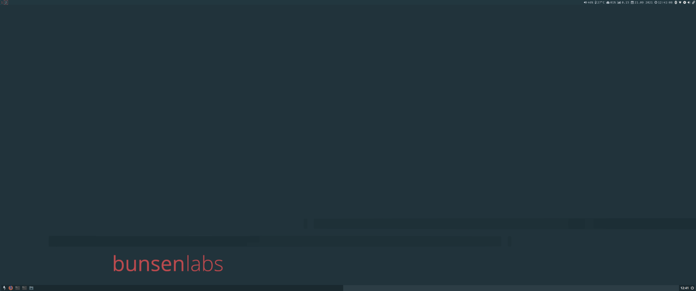

# Bunsenlabs Lithium i3 Configs
These configs are for use with Bunsenlabs Lithium. They will change the default window manager from Openbox to i3 while keeping the default tint2 panel, menus, and theming.

Once updated it should look something like this:

## Not installed by default on BL
- i3 (incl i3status)
	- To install the meta-package with everything run `sudo apt install i3`
- FiraCode (my preferred font but you can change this in the configs if you don't like it)
	- To install run `sudo apt install fonts-firacode`
- FontAwesome (for the i3status icons)
	- To install run `sudo apt install fonts-font-awesome`

## Installation
These instructions assume that you don't already have i3/i3status custom configs in place. If you do have custom i3 configs in place you'll want to just copy & pase parts of the *DOTconfig/i3/config* and *DOTconfig/i3status/config* files into your own configs (mainly the colors and any bunsen specific lines such as bl-exit keybind, and floating rule for same).
- Clone this repo somewhere you can find it on your computer 
	- e.g. to clone to your *Downloads* folder `cd ~/Downloads && git clone https://github.com/nealbrophy/bunsenlabs-lithium-i3`
- Backup the existing configs in case something goes wrong or you want to revert to openbox
	- Backup *.config/bunsen/autostart*: `cp ~/.config/bunsen/autostart ~/.config/bunsen/autostart.bk`
	- Backup *.config/dmenu/dmenu_bind.sh*: `cp ~/.config/dmenu/dmenu_bind.sh ~/.config/dmenu/dmenu_bind.sh.bk`
	- Backup *.config/tint2/tintrc*: `cp ~/.config/tint2/tint2rc ~/.config/tint2/tint2rc.bk`
	- Backup *.config/conky/conky.conf*: `cp ~/.config/conky/conky.conf ~/.config/conky/conky.conf.bk`
- Copy the configs from this repo to the locations matching the folder names so copy *DOTconfig/bunsen/autostart* to *.config/bunsen/* so it replaces the default *autostart* (if you can't see the *.config* directory on your system open the filemanager, Thunar, and while in your home directory hit *Ctrl+h* to show hidden folders).
	- Replace *.config/bunsen/autostart*: From within the cloned repo run `cp DOTconfig/bunsen/autostart ~/.config/bunsen/`
	- Replace *.config/dmenu/dmenu_bind.sh*: From within the cloned repo run `cp DOTconfig/dmenu/dmenu_bind.sh ~/.config/dmenu/`
	- Replace *.config/tint2/tintrc*: From within the cloned repo run `cp DOTconfig/tint2/tint2rc ~/.config/tint2/`
	- Replace *.config/conky/conky.conf*: From within the cloned repo run `cp DOTconfig/conky/conky.conf ~/.config/conky/`
	- Create the i3 config folder: run `mkdir ~/.config/i3` (if you already started i3 and created the default config you can skip this)
	- Copy the i3 config: From within the cloned repo run `cp DOTconfig/i3/config ~/.config/i3/`
	- Create the i3 status folder: run `mkdir ~/.config/i3status` (i3 doesn't create this folder by default so unless you already manually created it you should do this step)
	- Copy the i3status config: From within the cloned repo run `cp DOTconfig/i3status/config ~/.config/i3status/`
That should be it. Just reboot or logout & log back in.

## Credits
- Bunsenlabs is a wonderful distro and you can [support them here](https://www.bunsenlabs.org/donations.html)
- i3Status config is a customised version of EndeavourOS config, another wonderful distro you can [support](https://endeavouros.com/donate/)
- A couple of the colors in the i3status config are taken from [this lxterminal setup](https://entornosgnulinux.com/2020/08/13/tip-xxiv-color-schemes-y-lxterminal-manager-en-bunsenlabs-lithium/)
